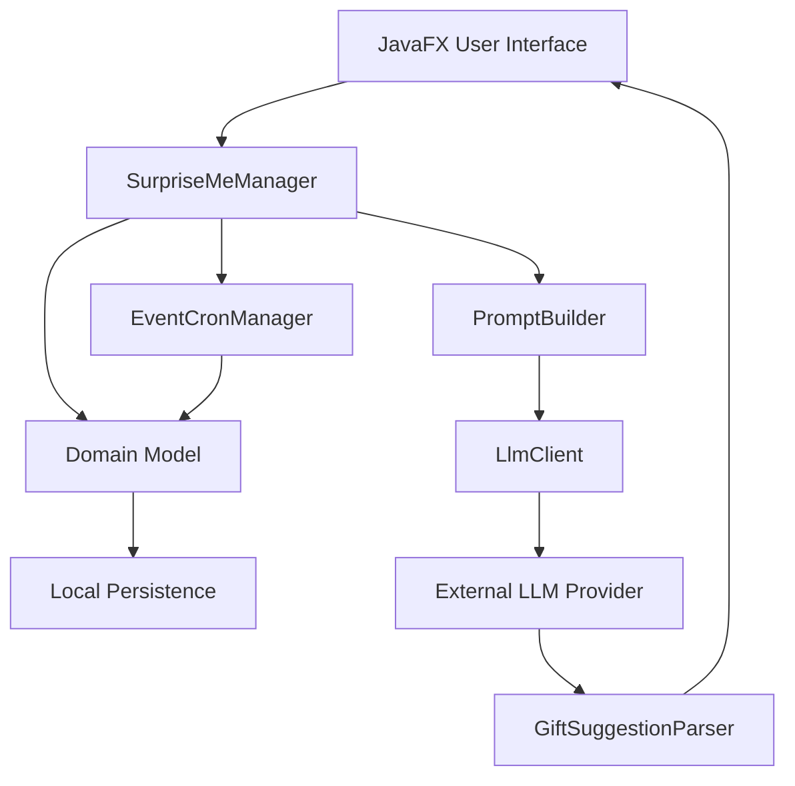
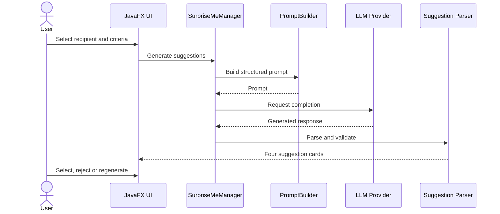

# Project Title

## Contents

- [1. Team](#1-team)
- [2. Vision and Scope](#2-vision-and-scope)
  - [2.1 Problem Statement](#21-problem-statement)
  - [2.2 Vision \& Scope of the Solution](#22-vision--scope-of-the-solution)
- [3. Requirements](#3-requirements)
  - [3.1 Use Case Diagram](#31-use-case-diagram)
  - [3.2 Mockups](#32-mockups)
  - [3.3 User Stories](#33-user-stories)
- [4. Definition of done](#4-definition-of-done)
- [5. Architecture and Design](#5-architecture-and-design)
  - [5.1 Domain Model](#51-domain-model)
  - [5.2 Sequence Diagram](#52-sequence-diagram)
  - [5.3 Class Diagram](#53-class-diagram)
  - [5.4 Programming Guidelines](#54-programming-guidelines)
- [6. Risk Plan](#6-risk-plan)
- [7. Pre-Game](#7-pre-game)
- [8. Release Plan](#8-release-plan)
  - [8.1 Release 1](#81-release-1)
  - [8.2 Release 2](#82-release-2)
- [9. Increments](#9-increments)
  - [9.1 Sprint 1](#91-sprint-1)
  - [9.2 Sprint 2](#92-sprint-2)
  - [9.3 Sprint 3](#93-sprint-3)
  - [9.4 Sprint 4](#94-sprint-4)

## 1. Team

| Name | Student Number | Email |
| --- | --- | --- |
| Celso André Ferreira Jordão | 2003008910 | a21130067@isec.pt |  
| Davi Nasser Torres Gama | 2022107363 | a2022107363@isec.pt |
| Hugo Rafael da Assunção Gomes | 2023133155 | a2023133155@isec.pt |
| Rita Mariana Alves Henriques | 2023133628 | a2023133628@isec.pt |
| Rui Manuel Borges Casaca | 2023111650 | a2023111650@isec.pt |

***

## 2. Vision and Scope

### 2.1 Problem Statement

#### Project background

Gift-giving is a deeply ingrained social practice, but finding the perfect gift for someone can often be stressful, time-consuming, and uncertain. Many people struggle with selecting gifts that are meaningful, appropriate, and personalized to the recipient’s preferences. This challenge is amplified by the overwhelming number of products available online, leading to decision fatigue and, at times, poor gift choices. 

Our team identified this recurring problem through user feedback and market research (well let’s face it… ourselves, our close friends and relatives), which showed that people delay gift purchases due to indecision or resort to generic, impersonal gifts just due to the need of offering something. Previous attempts to address this problem included static recommendation lists and simple filtering tools on e-commerce platforms. However, these solutions lacked personalization, requiring users to manually browse through countless options. 

After evaluating these shortcomings, we concluded that a more intelligent, context-aware solution was needed. The decision was made to build an application powered by a language model that can analyze recipient characteristics and generate gift recommendations from the information supplied for each request. The current prototype does not train on or automatically reuse historical feedback.

#### Stakeholders

* Gift Vendors & Retail Partners: Businesses that supply the gift options recommended by the application. Their need is to ensure their products are accurately represented, discoverable, and recommended to relevant users, which can boost their sales.

* Affiliate Partners: Companies that provide referral or affiliate marketing opportunities through commission-based programs. Their primary need is accurate and transparent tracking of clicks, leads, and purchases generated by the application. Additionally, affiliate partners are interested in the quality and relevance of the referred traffic, as higher conversion rates benefit both the partners and the application.

* Data Providers: External services or APIs that deliver essential information such as product catalogs, pricing information, stock availability or user analytics. Their need is reliable integration with the application and adherence to usage terms.

* Data Analysts: Professionals who analyze user behavior, gift recommendation history, and interaction patterns within the application. Their need is to access accurate, aggregated, and well-structured data to identify trends, improve recommendation algorithms, and support the development of new features or products. They may also leverage insights to optimize targeted advertising and marketing campaigns, ensuring that users receive more relevant suggestions while stakeholders benefit from increased engagement and revenue opportunities.

#### Users

* Frequent Gift Buyers: Users of all ages who regularly purchase gifts for friends, family, or colleagues throughout the year for various occasions. Their needs include reducing gift selection time, finding meaningful and personalized recommendations, and maintaining organized records of past gifts and recipient preferences. They benefit from historical tracking, recipient management, and reminder systems for upcoming events.

* Casual Gift Buyers: Individuals who purchase gifts sporadically for special occasions (birthdays, anniversaries, holidays). They need quick, hassle-free recommendations without complex setup requirements and using minimal input. 

* Last-minute Shoppers: Users that are under time pressure and need immediate solutions. They value recommendations that prioritize availability, fast shipping, and instant purchase links. 

***

### 2.2 Vision & Scope of the Solution

#### Vision statement

The vision of this project is to create an intelligent, user-friendly desktop application that takes the stress and guesswork out of gift-giving by providing personalized, thoughtful suggestions in minutes. By leveraging artificial intelligence, the app will learn from user input, recipient preferences, and contextual information (such as occasion, relationship, and budget) to generate gift recommendations. 

This project will benefit both individuals and organizations. For users, it transforms the gift selection process from a frustrating chore into a seamless experience that delivers relevant, high-quality suggestions. Consequently, they will save time, reduce decision fatigue, and make gift-giving more meaningful and enjoyable. For businesses and partners, it provides an opportunity to connect with engaged customers who are ready to purchase. 

By solving a widespread and relatable problem, this application has the potential to become the go-to platform for anyone seeking to give better gifts — strengthening relationships, enhancing user satisfaction, and creating measurable value for all stakeholders involved. 

#### List of features

* User Profile Management: The application provides comprehensive user account management where users can store their personal information. This also includes profile creation and login functionality.

* Recipient Management (Enjoyers): Users can create and maintain detailed profiles for gift recipients, known as Enjoyers, including name, date of birth, relationship type, interests, things to avoid, and historical gift feedback. This feature enables personalized recommendations based on comprehensive Enjoyers data.

* AI-Powered Gift Recommendation Engine: The core feature utilizing LLM API to generate personalized gift suggestions based on Enjoyers' profiles, occasion, budget constraints, gift categories (products vs. experiences vs. digital), as well as sustainability and utility considerations.

* Spontaneous Suggestions: A streamlined recommendation feature for users who want immediate gift ideas without selecting specific Enjoyers, providing general suggestions based on minimal target description and customizable parameters such as budget, category, and occasion type.

* AI-Powered Giftcard Message Recommendation Engine: Generates personalized, occasion-specific messages tailored to each Enjoyer’s profile and relationship.

* Gift History Tracking: Comprehensive local record of gifts, including Enjoyer, occasion and satisfaction feedback (liked/disliked). The feedback is available for user reference but is not currently included in recommendation prompts.

* Data Persistence and Sync: Local data storage system that maintains user profiles, Enjoyers information, gift history, and preferences across application sessions, ensuring continuity and personalization over time.

* Chronological Event List: The application allows users to create and manage events, displayed in a list ordered by date. Events are automatically removed as time progresses, ensuring the dashboard highlights only upcoming occasions (e.g., within the next month).

#### Features that will not be developed

* Social Media Integration: While considered as a future enhancement, direct integration with social media platforms for Enjoyers data gathering or gift sharing functionality will not be included in this initial version due to time constraints and project scope limitations. 

* E-commerce Integration: Direct purchasing capabilities or integration with online shopping platforms will not be implemented, as this project focuses on recommendation generation rather than transaction processing. 

* Mobile Application: The application will be developed exclusively for desktop platforms, with mobile versions considered for future iterations. 

* Real-time Product Price Tracking: Live pricing updates or price comparison features across multiple retailers will not be included. 

* Advanced Analytics Dashboard: Detailed analytics about user behavior, recommendation success rates, or comprehensive reporting features are outside the current scope. 

* Multi-language Support: The application will be developed in English only, with localization features planned for future releases. 

* Custom Tag Management: While mentioned as a nice-to-have, fully customizable tagging systems for gift categorization will not be implemented in the initial version. 

* Event Reminder System: Automated notification system that alerts users about upcoming gift-giving occasions such as birthdays, holidays, and anniversaries.

* Calendar Visualization & Export: Provides a visual calendar view of upcoming gift-giving occasions, linked to Enjoyers’ profiles and past gift history. Users can easily browse monthly or yearly timelines, filter by occasion type, and export selected events to external calendar applications (e.g., Google Calendar, Outlook, Apple Calendar) for seamless reminders and scheduling.

#### Assumptions

* Users will provide reasonably accurate information about Enjoyers, though the system is designed to handle incomplete or imprecise data through the "Spontaneous suggestion" feature. 

* Users will be willing to invest time in initial setup of Enjoyers profiles to receive better personalized recommendations. 

* Users have consistent internet connectivity since the application requires online access for AI recommendations. 

* The LLM API will remain freely available and reliable throughout the development period for this proof-of-concept implementation. 

* The development team possesses adequate technical expertise with the chosen technology stack to complete the project within the timeframe. 

* Users will be aware that the suggestions provided are generated via AI.

* Users can only generate one gift suggestion for an Enjoyer at a time.

* Each created event can be associated with only one Enjoyer.

* The application always provides four gift suggestions, which are refreshed if the user dislikes them.

***

## 3. Requirements

### 3.1 Use Case Diagram


***

### 3.2 Mockups

### 3.2 Mockups


***

### 3.3 User Stories

- [US01 – User Registration](https://gitlab.com/gps2526_g42/gps2526_g42/-/issues/25)
- [US02 – User Login](https://gitlab.com/gps2526_g42/gps2526_g42/-/issues/26)
- [US03 – User Profile Management](https://gitlab.com/gps2526_g42/gps2526_g42/-/issues/27)
- [US04 – Dashboard Overview](https://gitlab.com/gps2526_g42/gps2526_g42/-/issues/28)
- [US05 – View Enjoyers List](https://gitlab.com/gps2526_g42/gps2526_g42/-/issues/29)
- [US06 – Add New Enjoyer](https://gitlab.com/gps2526_g42/gps2526_g42/-/issues/30)
- [US07 – Edit Enjoyer Profile](https://gitlab.com/gps2526_g42/gps2526_g42/-/issues/31)
- [US08 – Delete Enjoyer](https://gitlab.com/gps2526_g42/gps2526_g42/-/issues/32)
- [US09 – Generate Gift Ideas for a Known Enjoyer](https://gitlab.com/gps2526_g42/gps2526_g42/-/issues/34)
- [US10 – Spontaneous Gift Suggestions](https://gitlab.com/gps2526_g42/gps2526_g42/-/issues/35)
- [US11 – Review and ask for another Gift Suggestion](https://gitlab.com/gps2526_g42/gps2526_g42/-/issues/36)
- [US12 – Gift Card Message Generation](https://gitlab.com/gps2526_g42/gps2526_g42/-/issues/37)
- [US13 – View Gift History](https://gitlab.com/gps2526_g42/gps2526_g42/-/issues/38)
- [US14 – Gift History Detail Management](https://gitlab.com/gps2526_g42/gps2526_g42/-/issues/39)
- [US15 – View Events](https://gitlab.com/gps2526_g42/gps2526_g42/-/issues/33)
- [US16 – Add Event](https://gitlab.com/gps2526_g42/gps2526_g42/-/issues/40)
- [US17 – Edit Event](https://gitlab.com/gps2526_g42/gps2526_g42/-/issues/41)
- [US18 – Delete Event](https://gitlab.com/gps2526_g42/gps2526_g42/-/issues/42)
- [US19 - User Logout](https://gitlab.com/gps2526_g42/gps2526_g42/-/issues/48)

***

## 4. Definition of done

This is a collection of criteria that must be completed for a User Story to be considered “done.”

1. All tasks done:
    - The acceptance criteria is met
    - Push to DEV - ready for review
2. Approved by, at least, 2 members of the team:
    - Merge request to QA - ready for acceptance test
3. Accepted by the QA
4. Code merged to main

***

## 5. Architecture and Design

### 5.1 Domain Model


***

### 5.2 Sequence Diagram


***

### 5.3 Class Diagram


***

### 5.4 Programming Guidelines

| Rule                                                                                                                                                 | Example (if applicable)                                                |
|------------------------------------------------------------------------------------------------------------------------------------------------------|------------------------------------------------------------------------|
| Use meaningful package names                                                                                                                         | pt.isec.gps2526.group42                                                |
| Group related classes logically. Model includes classes related to data, as well as the class manager. UI includes classes related to user interface | N.A.                                                                   |
| Classes names should be written in PascalCase                                                                                                        | SurpriseMeManager                                                      |
| Variables and methods should be written in camelCase                                                                                                 | loggedUser<br/>getEnjoyersNames()                                      | 
| Always include a verb in methods names to assure the clear purpose                                                                                   | editGift()                                                             |
| Constants (static final attributes) and Enumerations should be written in upper case with underscores                                                | VALENTINES_DAY                                                         |
| Always use clear and descriptive names. Avoid abbreviations                                                                                          | idEnjoyer<br/>// avoid idE                                             |
| Always use proper indentation (only tabs, no spaces)                                                                                                 | N.A.                                                                   |
| Use braces even for single-line if statements                                                                                                        | if(condition){<br/>&nbsp;&nbsp;&nbsp;&nbsp;//single instruction<br/>}  |
| Keep lines short (e.g. max 120 characters)                                                                                                           | N.A.                                                                   |
| Place opening braces on the same line                                                                                                                | if(condition){<br/>&nbsp;&nbsp;&nbsp;&nbsp;//code<br/>}                |
| Add a single blank line between methods for readabiliy                                                                                               | N.A.                                                                   |
| Keep fields private or protected. Encapsulation is key                                                                                               | N.A.                                                                   |
| Use final for variables that shouldn’t change                                                                                                        | N.A.                                                                   |                                                                                                    
| Avoid magic numbers. Use named constants                                                                                                             | N.A.                                                                   |                                                                                                         
| Write meaningful comments only where necessary. Prefer self-explanatory code                                                                         | N.A.                                                                   |                                                                     
| Start defining classes by constants, then attributes and finally methods                                                                             | N.A.                                                                   |                                                                        
| Use specific exceptions, not just Exception                                                                                                          | N.A.                                                                   |                                                                                                      
| Log errors with enough context for debugging                                                                                                         | N.A.                                                                   |

***

## 6. Risk Plan

##### Threshold of Success

The project fails if:
- The essential functionalities, classified as “Must” features, are not completed or do not function as expected by the first release date.
- The main functionalities, classified as “Should” features, are not completed or do not function as expected by the second release date.
- The final demo, which demonstrates all the functionalities of SurpriseMe app, is not presented to the client by the final release date. 

The project is successful if:
- By the first release date, all "Must" features are implemented and pass acceptance tests with no known critical defects.
- By the second release date, all “Should” features are implemented and pass acceptance tests with no known critical defects.
- All team members give average score of 5 or better on a job satisfaction survey conducted at the last meeting before the final release.

##### Risk List

RSK1 – PxI: 2x5 = 10; Reliability on a free LLM API without Service Level Agreement guarantees might compromise the core functionalities of the app
- The team relies on a free LLM API without Service Level Agreement (SLA) guarantees; the API could become unavailable, slow, or implement strict rate limiting during critical development phases, compromising the core functionalities of the app.
- Probability: 2
- Impact: 5
- Risk Score: 10

RSK2 – PxI: 3x4 = 12; The team has no or low experience in software estimation and development, therefore it might cause underestimation and development difficulties, delaying the project in an uncontrolled way
- The team has limited experience with software estimation methodologies and Story T-shirt sizing, which led to some estimation discrepancies. Systematic underestimation of complex User Stories could cause consistent sprint overruns, missed release dates, and accumulation of unfinished work across sprints. The team's lack of experience may also lead to development issues, including insufficient code quality and adherence to best practices, as well as deficiencies in component integration and testing. These issues can result in low-quality code, maintenance challenges, undetected failures, and bugs before release.
- Probability: 3
- Impact: 4
- Risk Score: 12

RSK3 – PxI: 4x5 = 20; LLM hallucination might cause poor user experience and low satisfaction with the delivered product
- LLM-generated gift suggestions may be inconsistent, inappropriate, or fail to align with user preferences; quality of AI responses depends heavily on prompt engineering. LLM hallucination might cause poor user experience, low satisfaction with recommendations, need for extensive prompt refinement and testing, potentially requiring more iterations during development.
- Probability: 4
- Impact: 5
- Risk Score: 20

RSK4 – PxI: 5x4 = 20; New LLM Models from different vendors would require redesigning the data integration process and redoing all prompt engineering
- Artificial Intelligence models, particularly LLMs, are currently in a phase of exponential evolution, which poses a significant risk of the emergence of a more efficient LLM that would require an unsustainable redesign of the data integration process.
- Probability: 5
- Impact: 4
- Risk Score: 20

RSK5 – PxI: 2x4 = 8; External tools and platforms may experience unexpected downtime, API changes, or compatibility issues, which would lead to development interruptions
- External tools and platforms (e.g. GitLab, IntelliJ, Microsoft Teams, etc.) may experience unexpected downtime, API changes, or compatibility issues, which would lead to development interruptions, loss of version control access, communication breakdowns, and potential loss of uncommitted work or sprint progress visibility.
- Probability: 2
- Impact: 4
- Risk Score: 8

##### Mitigation Actions (risk level>=20)

RSK3
- Contingency Plan (CP) – Manual/Expert Review Escalation Path: Implement a Contingency Workflow where, if a user flags a recommendation as "inappropriate" or "irrelevant", the system automatically triggers a manual review process by a human expert. The reviewer investigates the prompt/response pair, corrects the data, and uses the failure case to refine the prompt, thus ensuring the user's experience is rectified.

RSK4
- MS (Minimization Strategy) – Implement a Vendor-Agnostic LLM Abstraction Layer: Design and implement classes that sit between the core application and the specific LLM vendor's API. This layer standardizes the request and response format (input prompts, output parsing, metadata, etc.). If a new vendor is adopted, there is only need to rewrite the code within this small abstraction layer, thus avoiding a complete redesign of the overall application architecture.
- MS (Minimization Strategy) – Create and Maintain a Gold-Standard Prompt/Result Test Dataset (Regression Suite): Develop a comprehensive dataset containing diverse production prompts and their verified, desired outputs (expected results). This dataset serves as a regression test suite. It is used to automatically evaluate and score the performance of any new LLM model or any new prompt changes. This minimizes the impact of new models by ensuring quality remains consistent across changes.

***

## 7. Pre-Game
### Sprint 0 Plan

- Goal: Setup complete development environment and establish team workflow for productive development in Sprint 1.
- Dates: from 7/Oct to 21/Oct, 2 weeks
- Sprint 0 Backlog:
  - [Task 1 – Write Team](https://gitlab.com/gps2526_g42/gps2526_g42/-/issues/17)
  - [Task 2 – Write Vision & Scope](https://gitlab.com/gps2526_g42/gps2526_g42/-/issues/18)
  - [Task 3 – Write Requirements](https://gitlab.com/gps2526_g42/gps2526_g42/-/issues/19)
  - [Task 4 – Write DoD](https://gitlab.com/gps2526_g42/gps2526_g42/-/issues/12)
  - [Task 5 – Write Architecture & Design](https://gitlab.com/gps2526_g42/gps2526_g42/-/issues/11)
  - [Task 6 – Create repository with “GPS Git” Workflow](https://gitlab.com/gps2526_g42/gps2526_g42/-/issues/15)
  - [Task 7 – Write Pre-Game](https://gitlab.com/gps2526_g42/gps2526_g42/-/issues/13)
  - [Task 8 – Write Release Plan](https://gitlab.com/gps2526_g42/gps2526_g42/-/issues/9)
  - [Task 9 – Write Product Increments](https://gitlab.com/gps2526_g42/gps2526_g42/-/issues/21)
  - [Task 10 – Create Product Board](https://gitlab.com/gps2526_g42/gps2526_g42/-/issues/10)
  - [Task 11 – Create Sprint 0 Board](https://gitlab.com/gps2526_g42/gps2526_g42/-/issues/14)
  - [Task 12 – Write US in PB, estimate (SML), prioritize (MoSCoW), sort](https://gitlab.com/gps2526_g42/gps2526_g42/-/issues/8)
  - [Spike 1 – Scene Builder](https://gitlab.com/gps2526_g42/gps2526_g42/-/issues/24)

- Sprint 0 plan and KOM: [link](https://isecpt.sharepoint.com/:p:/s/GPS2526-Team42/EezSp9gy9u5Mg0q8bftR230BcuzWMBm1HT9cnnr1UQ64Pg)

***

## 8. Release Plan

### 8.1 Release 1

- Goal: MVP - Develop the core functionalities of the SurpriseMe app, enabling users to manage enjoyer profiles, receive and review personalized or spontaneous gift suggestions, view gift history and get automated gift card messages, to support a complete gift recommendation experience.

- Date: 18/Nov

- Sprint 1 [21/Oct – 4/Nov]:  
  - [US06 – Add New Enjoyer](https://gitlab.com/gps2526_g42/gps2526_g42/-/issues/30)
  - [US05 – View Enjoyers List](https://gitlab.com/gps2526_g42/gps2526_g42/-/issues/29)
  - [US07 – Edit Enjoyer Profile](https://gitlab.com/gps2526_g42/gps2526_g42/-/issues/31)
  - [US10 – Spontaneous Gift Suggestions](https://gitlab.com/gps2526_g42/gps2526_g42/-/issues/35)
  
- Sprint 2 [4/Nov – 18/Nov]:
  - [US09 – Generate Gift Ideas for a Known Enjoyer](https://gitlab.com/gps2526_g42/gps2526_g42/-/issues/34)
  - [US13 – View Gift History](https://gitlab.com/gps2526_g42/gps2526_g42/-/issues/38)
  - [US11 – Review and ask for another Gift Suggestion](https://gitlab.com/gps2526_g42/gps2526_g42/-/issues/36)
  - [US14 – Gift History Detail Management](https://gitlab.com/gps2526_g42/gps2526_g42/-/issues/39)
  - [US12 – Gift Card Message Generation](https://gitlab.com/gps2526_g42/gps2526_g42/-/issues/37)

- Release: V1.0

***

### 8.2 Release 2

- Goal: Final release – Complete the SurpriseMe app by implementing user authentication and profile management, event features, enjoyer deletion and dashboard visualization – delivering a refined and fully functional final product.​

- Date: 16/Dec

- Sprint 3 [18/Nov – 2/Dec]:
  - [US16 – Add Event](https://gitlab.com/gps2526_g42/gps2526_g42/-/issues/40)
  - [US15 – View Events](https://gitlab.com/gps2526_g42/gps2526_g42/-/issues/33)
  - [US17 – Edit Event](https://gitlab.com/gps2526_g42/gps2526_g42/-/issues/41)
  - [US04 – Dashboard Overview](https://gitlab.com/gps2526_g42/gps2526_g42/-/issues/28)

- Sprint 4 [2/Dec – 16/Dec]:
  - [US03 – User Profile Management](https://gitlab.com/gps2526_g42/gps2526_g42/-/issues/27)
  - [US01 – User Registration](https://gitlab.com/gps2526_g42/gps2526_g42/-/issues/25)
  - [US02 – User Login](https://gitlab.com/gps2526_g42/gps2526_g42/-/issues/26)
  - [US18 – Delete Event](https://gitlab.com/gps2526_g42/gps2526_g42/-/issues/42)
  - [US08 – Delete Enjoyer](https://gitlab.com/gps2526_g42/gps2526_g42/-/issues/32)
  - [US19 - User Logout](https://gitlab.com/gps2526_g42/gps2526_g42/-/issues/48)

- Release: V2.0

***

## 9. Increments

### 9.1 Sprint 1
##### Sprint Plan

- Goal: Create the base architecture of the app and it's interface. Allow users to add Enjoyers to their list, edit their profiles, view the corresponding list, and ask for spontaneous gift suggestions.

- Dates: from 21/Oct to 4/Nov, 2 weeks

- Team capacity = 40 hours (2 Weeks * 5 Team Elements * 4 Hours/Week)

- Roles:
  - Product Owner: Davi Gama
  - Scrum Master: Rui Casaca
  - QA Engineer: Rita Henriques

- To do:
  - [US06 – Add New Enjoyer](https://gitlab.com/gps2526_g42/gps2526_g42/-/issues/30) [M]: As a user, I want to add a new enjoyer profile, So that I can receive personalized gift suggestions for them
  - [US05 – View Enjoyers List](https://gitlab.com/gps2526_g42/gps2526_g42/-/issues/29) [L]: As a user, I want to see all my enjoyers in a list, So that I can manage the people I give gifts to
  - [US07 – Edit Enjoyer Profile](https://gitlab.com/gps2526_g42/gps2526_g42/-/issues/31) [M]: As a user, I want to edit an existing enjoyer’s information, So that I can keep their preferences up to date
  - [US10 – Spontaneous Gift Suggestions](https://gitlab.com/gps2526_g42/gps2526_g42/-/issues/35) [XL]: As a user, I want quick gift ideas without selecting a specific enjoyer, So that I can find gifts for new people or urgent needs
  - [Spike 2 - LLM Integration 2](https://gitlab.com/gps2526_g42/gps2526_g42/-/issues/23): LLM Integration 
  
- Story Points: 2M + 1L + 1XL

- Analysis: The team prioritized features necessary for the initial app architecture and user experience. The selected user stories align with establishing core user flows and testing LLM integration for future recommendation features. The workload (2M + 1L + 1XL stories) fits within the team’s 40h capacity, with awareness that US10 (Spontaneous Gift Suggestions) and the LLM Integration Spike carry higher uncertainty and technical risk. The team agreed to start with Enjoyer management before progressing to LLM integration. Overall confidence in meeting the sprint goal is medium-high, contingent on resolving LLM setup dependencies early in the sprint.

- Sprint plan: [link](https://isecpt.sharepoint.com/:p:/s/GPS2526-Team42/EYzGPHX_ryZGmaJvGysa7g0BjTX24OKSUkMS235WEZYP5g)

##### Sprint Review

- Analysis:
    - QA validated acceptance criteria and tested the end to end flow. The Scrum Master ensured the process and the sprint board were followed. The Product Owner prioritized the sprint and accompanied the increment demo
    - Planned 40h and spent 45h. Deviation 5h
    - We are optimistic that some upcoming user stories will require less time because important UI elements and the LLM path are already in place. Sizes will be adjusted in the next sprints where appropriate

- Technical adjustments:
    - When a gift is chosen the detail screen must also present a long and clear description that explains why the gift fits the person including idea of use possible variations and an approximate price
    - Refactor GiftFlowModal by splitting it into smaller classes per window will be considered in future sprints. The team will continue the separation with DefineGiftModal, the four gifts window and the chosen gift detail window to reduce complexity and make layout work easier

- Story Points: 1XL; 2M; 1L

- Version: 0.1

- Client analysis:
    - During Sprint 0, there was a slight misalignment with the client regarding the Product Backlog. The team had planned to include the features for creating an account and logging in, to facilitate time management. However, the client requested a change in priorities, as those features do not add value.

- Conclusions:
    - All user stories planned for the sprint were completed successfully, meeting the defined acceptance criteria.
    - The team delivered a stable and functional foundation for the application, including core UI components and the first LLM integration.
    - The small deviation in planned hours demonstrates the need for slight adjustments in future estimations, but overall planning accuracy was good.
    - Collaboration between roles was effective, and responsibilities were clearly followed after minor adjustments.
    - The progress achieved in this sprint establishes a strong base for Sprint 2, where the team will focus on expanding the recommendation features and improving the gift detail flow.

##### Sprint Retrospective

- What went well:
    - Using ChatGPT to generate UI code significantly accelerated the process
    - The interface created is very close to the mockups
    - The team adapted very quickly to client's feedback to restructure the Product Backlog
    - Timely analysis of small errors and inconsistencies in the code
    - Better organization of the code by splitting into packages which made it clearer and easier to understand

- What could be improved:
    - Inconsistent routine applying the established programming guidelines, as well as the workflow
    - Difficulty separating the Developer and QA Engineer roles
    - Much of the ChatGPT generated code was hard to read which required deep review
    - Overlap of work on code despite tasks being divided which led to higher hours spent
    - The API and the LLM PromptBuilder needed several adjustments before stabilizing
    - Although meetings took place, communication was insufficient, specially clarification of the team's development progress

- What will we commit to improve in the next sprint:
    - User Stories should be developed at the latest, by the mid-sprint meeting
    - If it is necessary to modify or integrate code being developed by another team member, there must be communication between both parties (using WhatsApp)
    - Be more critical when accepting AI generated code in order to avoid later rework
    - Each member should post a short update three times per week on WhatsApp (e.g., when starting development, how it’s going, and when finishing)
    
- Sprint review and retrospective: [link](https://isecpt.sharepoint.com/:p:/s/GPS2526-Team42/EfgP5tOkIQpMmMA1Z36Xd_sBOYLCm7Abv_JEn94we2itgg)

***

### 9.2 Sprint 2
##### Sprint Plan

- Goal: Allow users to request generating gift ideas for a known Enjoyer, as well as review and request another gift suggestion in case of dissatisfaction, view the gift history, and its details.

- Dates: from 4/Nov to 18/Nov, 2 weeks

- Team capacity = 40 hours (2 Weeks * 5 Team Elements * 4 Hours/Week)

- Roles:
  - Product Owner: Rui Casaca
  - Scrum Master: Hugo Gomes
  - QA Engineer: Celso Jordão

- To do:
  - [US09 – Generate Gift Ideas for a Known Enjoyer](https://gitlab.com/gps2526_g42/gps2526_g42/-/issues/34) [L]: As a user, I want to generate gift ideas for a selected enjoyer, So that I can get personalized recommendations
  - [US13 – View Gift History](https://gitlab.com/gps2526_g42/gps2526_g42/-/issues/38) [L]: As a user, I want to view my complete gift history, So that I can track what I gave, to whom, when, state of purchase, and feedback
  - [US11 – Review and ask for another Gift Suggestion](https://gitlab.com/gps2526_g42/gps2526_g42/-/issues/36) [L]: As a user, I want to review AI-generated gift suggestions, So that I can request new ones
  - [US14 – Gift History Detail Management](https://gitlab.com/gps2526_g42/gps2526_g42/-/issues/39) [M]: As a user, I want to manage individual gift details, So that I can update status and provide feedback

- Story Points: 1M + 3L

- Analysis: The team maintained the same capacity of 40h, distributed evenly across development, QA, and product roles. The selected user stories are focused on connecting the LLM to known Enjoyers, allowing a generation of contextual gift ideas. The inclusion of gift history management and suggestion review completes the first full recommendation lifecycle of the app. Risks include potential latency or inconsistency in AI responses, which will be mitigated by early testing and prompt adjustments. With the LLM and interface elements already established in Sprint 1, the workload is expected to fit comfortably within the available time. The team will continue using the same Git workflow and maintain daily communication to avoid code overlap and ensure integration stability.

- Sprint plan: [link](https://isecpt.sharepoint.com/:p:/s/GPS2526-Team42/EfgP5tOkIQpMmMA1Z36Xd_sBOYLCm7Abv_JEn94we2itgg)

##### Sprint Review

- Analysis:
    - QA validated acceptance criteria and tested the end to end flow. The Scrum Master ensured the process and the sprint board were followed. The Product Owner prioritized the sprint goals.
    - Planned 40h and spent 40h, with one more user story done from Sprint 3 backlog:
      - [US12 – Gift Card Message Generation](https://gitlab.com/gps2526_g42/gps2526_g42/-/issues/37) [L]: As a user, I want AI-generated gift card messages, So that I can include personalized notes with my gifts
    - We are optimistic that some upcoming user stories sizes will be adjusted in the next sprints.

- Technical adjustments:
    - When a gift is chosen from the Enjoyers list, the detail screen must also present a long and clear description, and the estimated price, within the chosed price range.
    - When a gift suggestion is chosen for a known Enjoyer, is/her name must appear on the window title.

- Story Points: 1M + 4L

- Version: 1.0

- Client analysis:
    - In the meeting with the client, he requested an interface improvement: the name of the Enjoyer must be shown, when asking for a gift suggestion.

- Conclusions:
    - All user stories planned for the sprint were completed successfully, meeting the acceptance criteria.
    - The team delivered a stable and functional application, with a more developed UI and new LLM functionality.
    - Due to an early completion of the User Stories, the team began the next User Story from Sprint 3 Backlog.
    - Collaboration between roles was effective, and responsabilities were clearly followed after minor adjustments.
    - The progress achieved in this sprint establishes a strong base for Sprint 3, where the team will focus on expanding the Events features and implementing the Dashboard.

##### Sprint Retrospective

- What went well:
    - An additional User Story was successfully executed in this Sprint due to overestimated time in earlier ones.
    - The team’s effort in Sprint 1 proved crucial, as previous work saved time in this Sprint through reuse of UI components and LLM-related code.
    - The communication strategies introduced in the previous Sprint had a positive impact, improving information flow and reducing misunderstandings.

- What could be improved:
    - A misalignment was detected in our User Story estimates (time was overestimated).
    - The team is experiencing difficulties navigating and understanding certain parts of the codebase, which slows down implementation and bug fixing.

- What will we commit to improve in the next sprint:
    - When working on specific areas of the code, the team should actively refactor it into smaller, independent modules or functions that follow the defined standards.

- Sprint review and retrospective: [link](https://isecpt.sharepoint.com/:p:/s/GPS2526-Team42/EV8nThsRU6JLmgjGtI15ppEBwYKTyio7ko4kKU6Zko5g2A?e=libEvu)

***

### 9.3 Sprint 3
##### Sprint Plan

- Goal: Enable users to create, view, and edit events. Develop the dashboard to provide a clear, accessible overview of key information about events and other data.

- Dates: from 18/Nov to 2/Dec, 2 weeks

- Team capacity = 40 hours (2 Weeks * 5 Team Elements * 4 Hours/Week)

- Roles:
  - Product Owner: Rita Henriques
  - Scrum Master: Davi Gama
  - QA Engineer: Rui Casaca

- To do:
  - [US16 – Add Event](https://gitlab.com/gps2526_g42/gps2526_g42/-/issues/40) [L]: As a user, I want to add events, So that I can keep track of important gifting occasions
  - [US15 – View Events](https://gitlab.com/gps2526_g42/gps2526_g42/-/issues/33) [M]: As a user, I want a list of upcoming events, So that I can plan my gifting activities
  - [US17 – Edit Event](https://gitlab.com/gps2526_g42/gps2526_g42/-/issues/41) [M]: As a user, I want to edit an existing event, So that I can correct details or reschedule without losing the enjoyer link
  - [US04 – Dashboard Overview](https://gitlab.com/gps2526_g42/gps2526_g42/-/issues/28) [L]: As a user, I want to see a dashboard summarizing my activity, So that I can quickly access key information and navigate the app

- Story Points: 2M + 2L

- Analysis: The team kept the 40h capacity and is focused on finishing the event features and delivering the first dashboard version. This sprint will give users a clearer view of upcoming events and a more informative entry point. The selected stories align with the Release Plan and build on the foundations from previous sprints. With the reuse of existing components, the workload is expected to fit within the available time.

- Sprint plan: [link](https://isecpt.sharepoint.com/:p:/s/GPS2526-Team42/EV8nThsRU6JLmgjGtI15ppEBwYKTyio7ko4kKU6Zko5g2A?e=libEvu)

##### Sprint Review

- Analysis:
    - All user stories planned for the sprint were completed and integrated, providing a first complete version of the Events feature and the Dashboard.
    - QA validated the acceptance criteria and tested the end to end flow. The Scrum Master monitored the sprint board and ensured that blockers were quickly identified and discussed. The Product Owner followed the progress and aligned the team with the sprint goal.
    - During this sprint the team started to apply this decision and refactored some of the most complex areas of the code into smaller and more independent functions and classes. While we could not complete the refactoring of all classes, we consider that the most critical classes have been addressed and simplified within this sprint. Given that the QA effort was primarily focused on testing the existing codebase, the team decided to de-prioritize the remaining refactoring tasks for this sprint.
    
- Story Points: 2M + 2L

- Version: 1.1

- Client analysis:

- Conclusions:
    - The sprint goal was achieved. Users can now create, view and edit events and have a dashboard that summarizes key information about their gifting activity.
    - Despite lower available hours, the team maintained stable delivery, supported by strong informal communication and quick resolution of defects.
    - Partial refactoring of core classes already brought benefits in maintainability, but it also highlighted the need for a more extensive refactor in the final sprint.
    - The work done in this sprint prepares the application for the final Release 2, where user management and clean up actions will complete the overall experience.
    
##### Sprint Retrospective

- What went well:
    - We kept the formal sprint meetings and, despite the difficulties with time management, we were able to complete all the User Stories.
    - Development went smoothly and this was reflected in the quality of the tests.
    
- What could be improved:
    - Even though daily communication was very natural, we did not always keep a written record of the decisions made in informal conversations, which can make it difficult to review later what was decided.
    - The workload from other courses and projects was very high and significantly reduced the time available for this project.   

- What will we commit to improve in the next sprint:
    - A rule has been implemented requiring that all significant decisions (made in meetings or otherwise) be followed up with a concise summary of the conversation, to be documented by a team member at least through WhatsApp.
    - Given that the next sprint immediately precedes the Final Release, the team has committed to maximize feature development during the first week of the next sprint. The second week will be strictly dedicated to quality assurance, including comprehensive testing and essential performance improvements.

- Sprint review and retrospective: [link](https://isecpt.sharepoint.com/:p:/s/GPS2526-Team42/EekWrGKoVdhNkd2_deOVvQEBboRHihbaAI_WCmZZU586bQ?e=LqLeT3)

***

### 9.4 Sprint 4
##### Sprint Plan

- Goal: The primary goal is to build the essential user foundation: allowing users to register, login, and manage their profile. The secondary objective is to implement the “Delete Event” and “Delete Enjoyer” functions, which ensures the system has the basic tools needed for data cleanup and user self-management.

- Dates: from 2/Dec to 16/Dec, 2 weeks

- Team capacity = 40 hours (2 Weeks * 5 Team Elements * 4 Hours/Week)

- Roles:
  - Product Owner: Hugo Gomes
  - Scrum Master: Celso Jordão
  - QA Engineer: Davi Gama

- To do:
  - [US03 – User Profile Management](https://gitlab.com/gps2526_g42/gps2526_g42/-/issues/27) [M]: As an authenticated user, I want to manage my profile information, So that I can change my personal data
  - [US01 – User Registration](https://gitlab.com/gps2526_g42/gps2526_g42/-/issues/25) [M]: As a new user, I want to create an account using my email and password, So that I can access the SurpriseMe application
  - [US02 – User Login](https://gitlab.com/gps2526_g42/gps2526_g42/-/issues/26) [M]: As a registered user, I want to sign in with my credentials, So that I can access my personalized gift recommendations
  - [US18 – Delete Event](https://gitlab.com/gps2526_g42/gps2526_g42/-/issues/42) [S]: As a user, I want to delete an event, So that I can remove an event that does not make sense
  - [US08 – Delete Enjoyer](https://gitlab.com/gps2526_g42/gps2526_g42/-/issues/32) [S]: As a user, I want to delete an enjoyer, So that I can remove people I no longer gift to
  - [Spike 3 - Calendar in JavaFX](https://gitlab.com/gps2526_g42/gps2526_g42/-/issues/22) : Investigate the feasibility of implementing a simple calendar system in JavaFX, where the user can click on a specific day to open a window and create or edit an event. 

- Story Points: 2S + 3M

- Analysis: The team kept the 40h capacity and is focused on finishing the application. This sprint will give users the ability to register, login and manage their personal profile, as well as other minor functionalities. The team expects to deliver a good and stable final product.

- Sprint plan: [link](https://isecpt.sharepoint.com/:p:/s/GPS2526-Team42/EekWrGKoVdhNkd2_deOVvQEBboRHihbaAI_WCmZZU586bQ?e=LqLeT3)

##### Sprint Review

- Analysis:
  - The workflow continued to improve and the team managed to finish the product as intended.
  - Planned 40h and spent 40h, with one more user story done that was not planned:
    - [US19 - User Logout](https://gitlab.com/gps2526_g42/gps2526_g42/-/issues/48) [S]: As a logged in user, I want click a button to logout, So that I can close my session and return to the login menu

- Story Points: 3S + 3M

- Version: 2.0

- Client analysis:
    - TODO after meeting

- Conclusions:
    - All user stories planned for the sprint were completed successfully, meeting the acceptance criteria.
    - The team delivered a stable and functional application, according to the original plan.

##### Sprint Retrospective

- What went well:
    - The team maintained rapid, high-quality development of the remaining US.
    - Despite facing a problem that caused a delay in the project, the team managed to solve it and created a shared guideline to prevent similar problems from happening again.
    
- What could be improved:
    - The team decided not to hold the weekly meeting in the first week of the sprint due to concerns about other subjects.
    - The spike related to the calendar was not carried out due to lack of time and this feature being out of scope.
    - There were difficulties and extra time was spent on setting up SonarQube, as the instructions contained an error in a key step.
    
- What will we commit to improve in the next sprint:
    - Each team member will make an effort to ensure that meetings take place. If the team has limited time, meetings should be short (15 to 30 minutes) and address the most critical and essential issues. Responsible: Scrum Master
    - In a future sprint, revisit this issue. Responsible: Product Owner
    - The QA Engineer requested support from other team members and met online via teams to understand the problem and solve it as quickly as possible.    
    
- Sprint review and retrospective: [link](https://isecpt.sharepoint.com/:p:/s/GPS2526-Team42/IQBOaIkxxUkoSpv6EMrRPw_bAbe2dtAvmDFf3BOvgY1yVIg?e=dvm4TV)
=======
<div align="center">

# SurpriseMe Gift Assistant

### Personal gift planning and LLM-assisted recommendations in a JavaFX desktop application


</div>

## Overview

**SurpriseMe** is a JavaFX desktop application that helps users organise gift recipients, important occasions and gift history while generating personalised gift ideas through a configurable language-model API.

Users can build detailed recipient profiles, define gift criteria, request four personalised suggestions, reject or regenerate individual ideas and save the selected gift to their history.

The application also generates short gift-card messages and supports spontaneous recommendations when the user does not want to create a permanent recipient profile.

> [!NOTE]
> SurpriseMe is an educational prototype. Generated suggestions may be inaccurate, unavailable or unsuitable and should be reviewed before use.

## Main Features

### User Accounts

Users can:

- Create a local account;
- Authenticate using email and password;
- Update profile information;
- Configure name, email, date of birth, city and country;
- Log out while preserving application data locally.

The application is currently designed for local, single-device use.

### Recipient Management

Gift recipients are called **Enjoyers**.

An Enjoyer profile can contain:

- Name;
- Relationship to the user;
- Date of birth;
- City and country;
- Likes;
- Dislikes;
- Additional notes.

Users can create, view, edit and remove Enjoyers.

### Personalised Gift Suggestions

Suggestions can be generated from:

1. An existing Enjoyer;
2. A newly created Enjoyer;
3. A short spontaneous description.

The user can configure:

- Minimum and maximum budget;
- Occasion;
- Gift type;
- Ideas or preferences;
- Things to avoid;
- Sustainability preference;
- Practical-use preference.

Supported gift types include:

- Physical gifts;
- Experiences;
- Digital gifts;
- Do-it-yourself gifts;
- Any suitable type.

After an explicit confirmation, the application requests four suggestions from the configured language-model provider.

### Suggestion Review

Generated suggestions are shown as individual cards.

Users can:

- Review the title;
- Read the short and detailed descriptions;
- View the estimated price;
- Reject a suggestion;
- Regenerate one suggestion;
- Avoid duplicate or previously rejected ideas;
- Select a suggestion;
- Save the selected gift.

### Gift-Card Messages

After saving a gift, the application can generate a short message based on:

- Gift title;
- Gift description;
- Recipient;
- Relationship;
- Occasion.

For spontaneous gifts, a generic occasion-appropriate message can be generated.

The user decides whether the message is saved.

### Gift History

The history records:

- Gift name;
- Recipient;
- Occasion;
- Gift type;
- Creation date;
- Pending or gifted status;
- Good, neutral, bad or unknown feedback;
- Generated gift message.

Gift history can be searched and filtered by recipient.

> [!IMPORTANT]
> Historical feedback is stored for reference. The current recommendation prompt does not automatically learn from or incorporate previous feedback.

### Event Management

Users can:

- Create events;
- Associate events with Enjoyers;
- Edit and remove events;
- Search events;
- Filter events by occasion;
- Browse events by month.

When an Enjoyer has a date of birth, the application can create the corresponding birthday event for the selected month.

Recurring birthday dates are calculated through Quartz-style cron expressions.

### Dashboard

The dashboard provides an overview of:

- Upcoming events;
- Registered Enjoyers;
- Gift activity;
- Navigation to the principal application areas.

## Architecture



## Main Components

| Component | Responsibility |
| --- | --- |
| `SurpriseMeManager` | Facade between the interface, domain and external services |
| `SurpriseMe` | Application state and user-session management |
| `User` | Enjoyers, gifts and events belonging to one account |
| `Enjoyer` | Recipient profile and associated history |
| `Gift` | Selected gift, state, feedback and message |
| `Event` | Occasion, date and associated recipient |
| `EventCronManager` | Automatic birthday-event generation |
| `PromptBuilder` | Creation of gift and message prompts |
| `LlmClient` | Contract for the configured LLM provider |
| `GiftSuggestionParser` | Conversion of provider responses into suggestion objects |
| `SurpriseMeSerialization` | Local data persistence |

## Recommendation Flow



## Local Persistence

Application state is stored under the current user's home directory:

```text
~/.surprise_me/data.spm
```

For tests or isolated demonstrations, override the directory with the `surpriseme.data.dir` JVM property or the `SURPRISEME_DATA_DIR` environment variable. Maven tests use `target/test-data` and do not read or overwrite the user's normal data file.

The file can contain:

- Local accounts;
- Recipient profiles;
- Gift history;
- Events;
- User profile information.

Do not share this file or add it to version control.

## Privacy

Before a suggestion is generated, the interface asks for consent to send the selected recipient information to the configured external language-model provider. Cancelling leaves the provider uncalled.

Depending on the profile and criteria, this may include:

- Name;
- Relationship;
- Age;
- City and country;
- Likes and dislikes;
- Additional notes;
- Occasion;
- Budget.

Use fictional information for demonstrations and do not enter sensitive personal data.

## Technology Stack

| Area | Technology |
| --- | --- |
| Language | Java 21 |
| Interface | JavaFX |
| Build system | Apache Maven |
| LLM communication | Java HTTP Client |
| JSON | Jackson |
| Recurring dates | cron-utils |
| Persistence | Java object serialization |
| Testing | JUnit 5 |
| Architecture | Layered desktop architecture with a manager facade |
| Project process | User stories, sprint planning, QA and code review |

## Project Structure

```text
src/
|-- main/
|   |-- java/pt/isec/gps2526_g42/surprise_me/
|   |   |-- model/
|   |   |   |-- data/
|   |   |   |-- llm/
|   |   |   `-- security/
|   |   `-- ui/
|   `-- resources/pt/isec/gps2526_g42/surprise_me/ui/res/
`-- test/java/pt/isec/gps2526_g42/surprise_me/
```

## Requirements

Install:

- JDK 21;
- Apache Maven 3.9 or newer.

An API key is needed only when making a real generation request. Building and testing do not require one.

Check the installation:

```bash
java -version
mvn -version
```

## Configuration

Set the required environment variables.

### PowerShell

```powershell
$env:SURPRISEME_LLM_API_KEY = "YOUR_API_KEY"
$env:SURPRISEME_LLM_MODEL = "MODEL_ID_AVAILABLE_IN_YOUR_ACCOUNT"
$env:SURPRISEME_LLM_ENDPOINT = "https://api.groq.com/openai/v1/chat/completions"
```

### Linux or macOS

```bash
export SURPRISEME_LLM_API_KEY="YOUR_API_KEY"
export SURPRISEME_LLM_MODEL="MODEL_ID_AVAILABLE_IN_YOUR_ACCOUNT"
export SURPRISEME_LLM_ENDPOINT="https://api.groq.com/openai/v1/chat/completions"
```

Never commit API keys. A secret embedded in a distributed desktop client can be extracted; use only a restricted demonstration credential locally. A production distribution should call a controlled backend that owns the provider credential.

## Running

Clone the repository:

```bash
git clone https://github.com/DaviGama08/surpriseme-gift-assistant.git
cd surpriseme-gift-assistant
```

Run the tests:

```bash
mvn clean test
```

Start the application:

```bash
mvn clean javafx:run
```

## Building

Compile and validate:

```bash
mvn clean verify
```

The generated build files are placed in:

```text
target/
```

A self-contained installer is not currently provided.

## Testing

The test suite covers areas such as:

- Enumeration conversions;
- Enjoyer validation;
- Gift creation and editing;
- Event creation and recurrence;
- Cron date calculation;
- Manager operations;
- Gift criteria;
- Prompt generation.

Automated tests inject a fake `LlmClient`, so they remain deterministic, require no credential and never call the external provider. The suite also covers consent denial and PBKDF2 password verification.

GitHub Actions runs `mvn clean verify` on Linux and Windows without repository secrets.

## Development Process

The application was developed collaboratively through four two-week sprints.

The process included:

- Product backlog;
- User stories;
- Acceptance criteria;
- Sprint planning;
- Sprint reviews;
- Retrospectives;
- Rotating Product Owner, Scrum Master and QA roles;
- Merge-request reviews;
- Unit testing;
- Continuous integration;
- Static analysis.

A user story was considered complete only after implementation, peer review, QA acceptance and integration into the main branch.

## Current Limitations

- The application requires an external LLM service for generation;
- Provider availability and rate limits can affect the core feature;
- Suggestions may contain hallucinations or unavailable products;
- Historical feedback is not currently used in future prompts;
- Data is stored locally through Java serialization;
- Local passwords use salted PBKDF2 hashes; a successful login transparently migrates legacy SHA-3 or plaintext records;
- Accounts are local rather than cloud-based;
- There is no e-commerce integration;
- There are no purchase links or real-time prices;
- There is no automatic event-notification system;
- The application is available only in English;
- There is no mobile version;
- The current interface is not fully accessibility tested.

## Potential Improvements

Future development could include:

- Provider-independent LLM adapters;
- Structured response schemas;
- Feedback-aware recommendations;
- SQLite persistence;
- Encrypted local data;
- Password-reset support;
- Reminder notifications;
- Cloud synchronisation;
- Offline recommendation fallback;
- Product catalogue integration;
- Availability and price verification;
- Expanded accessibility support;
- Internationalisation;
- Native installers with `jpackage`;
- End-to-end JavaFX tests.

## Academic Context

SurpriseMe was developed collaboratively for the **Software Project Management** course of the Bachelor's Degree in Computer Engineering at the **Instituto Superior de Engenharia de Coimbra — ISEC**, during the 2025/2026 academic year.

The project focused on both software development and project-management practices:

- Requirements and scope;
- User stories;
- Risk management;
- Release planning;
- Scrum roles;
- Sprint reviews and retrospectives;
- Quality assurance;
- Continuous integration.

## Contributors

- **Davi Gama** — [@DaviGama08](https://github.com/DaviGama08)
- **Celso André Ferreira Jordão** — add GitHub profile
- **Hugo Rafael da Assunção Gomes** — add GitHub profile
- **Rita Mariana Alves Henriques** — add GitHub profile
- **Rui Manuel Borges Casaca** — add GitHub profile

## Licence

No open-source licence has currently been assigned.

The source code is available for portfolio and educational review. Reuse, modification or redistribution requires permission from the project authors.

---

<div align="center">

Developed as a collaborative Java desktop and agile software project.
