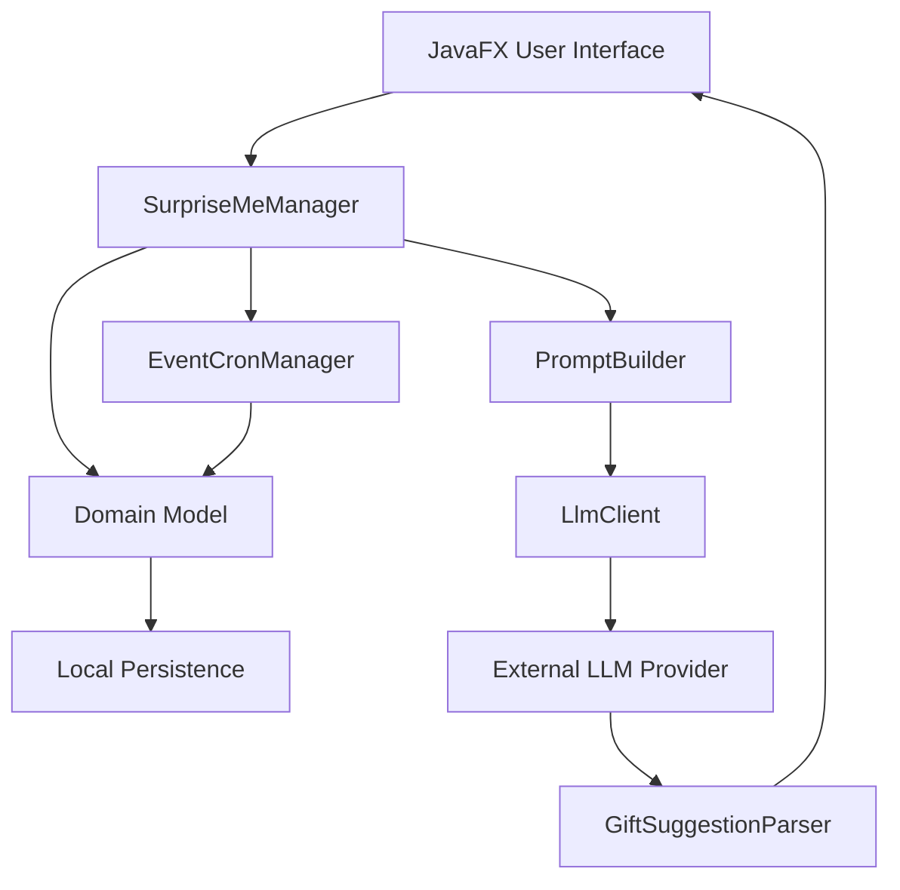
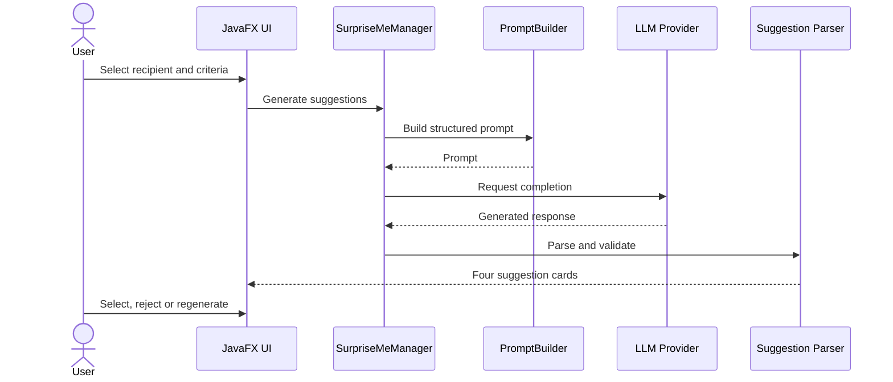

<div align="center">

# SurpriseMe Gift Assistant

### Personal gift planning and LLM-assisted recommendations in a JavaFX desktop application


</div>

## Overview

**SurpriseMe** is a JavaFX desktop application that helps users organise gift recipients, important occasions and gift history while generating personalised gift ideas through a configurable language-model API.

Users can build detailed recipient profiles, define gift criteria, request four personalised suggestions, reject or regenerate individual ideas and save the selected gift to their history.

The application also generates short gift-card messages and supports spontaneous recommendations when the user does not want to create a permanent recipient profile.

> [!NOTE]
> SurpriseMe is an educational prototype. Generated suggestions may be inaccurate, unavailable or unsuitable and should be reviewed before use.

## Main Features

### User Accounts

Users can:

- Create a local account;
- Authenticate using email and password;
- Update profile information;
- Configure name, email, date of birth, city and country;
- Log out while preserving application data locally.

The application is currently designed for local, single-device use.

### Recipient Management

Gift recipients are called **Enjoyers**.

An Enjoyer profile can contain:

- Name;
- Relationship to the user;
- Date of birth;
- City and country;
- Likes;
- Dislikes;
- Additional notes.

Users can create, view, edit and remove Enjoyers.

### Personalised Gift Suggestions

Suggestions can be generated from:

1. An existing Enjoyer;
2. A newly created Enjoyer;
3. A short spontaneous description.

The user can configure:

- Minimum and maximum budget;
- Occasion;
- Gift type;
- Ideas or preferences;
- Things to avoid;
- Sustainability preference;
- Practical-use preference.

Supported gift types include:

- Physical gifts;
- Experiences;
- Digital gifts;
- Do-it-yourself gifts;
- Any suitable type.

The application requests four suggestions from the configured language-model provider.

### Suggestion Review

Generated suggestions are shown as individual cards.

Users can:

- Review the title;
- Read the short and detailed descriptions;
- View the estimated price;
- Reject a suggestion;
- Regenerate one suggestion;
- Avoid duplicate or previously rejected ideas;
- Select a suggestion;
- Save the selected gift.

### Gift-Card Messages

After saving a gift, the application can generate a short message based on:

- Gift title;
- Gift description;
- Recipient;
- Relationship;
- Occasion.

For spontaneous gifts, a generic occasion-appropriate message can be generated.

The user decides whether the message is saved.

### Gift History

The history records:

- Gift name;
- Recipient;
- Occasion;
- Gift type;
- Creation date;
- Pending or gifted status;
- Good, neutral, bad or unknown feedback;
- Generated gift message.

Gift history can be searched and filtered by recipient.

> [!IMPORTANT]
> Historical feedback is stored for reference. The current recommendation prompt does not automatically learn from or incorporate previous feedback.

### Event Management

Users can:

- Create events;
- Associate events with Enjoyers;
- Edit and remove events;
- Search events;
- Filter events by occasion;
- Browse events by month.

When an Enjoyer has a date of birth, the application can create the corresponding birthday event for the selected month.

Recurring birthday dates are calculated through Quartz-style cron expressions.

### Dashboard

The dashboard provides an overview of:

- Upcoming events;
- Registered Enjoyers;
- Gift activity;
- Navigation to the principal application areas.

## Architecture



## Main Components

| Component | Responsibility |
| --- | --- |
| `SurpriseMeManager` | Facade between the interface, domain and external services |
| `SurpriseMe` | Application state and user-session management |
| `User` | Enjoyers, gifts and events belonging to one account |
| `Enjoyer` | Recipient profile and associated history |
| `Gift` | Selected gift, state, feedback and message |
| `Event` | Occasion, date and associated recipient |
| `EventCronManager` | Automatic birthday-event generation |
| `PromptBuilder` | Creation of gift and message prompts |
| `LlmClient` | Contract for the configured LLM provider |
| `GiftSuggestionParser` | Conversion of provider responses into suggestion objects |
| `SurpriseMeSerialization` | Local data persistence |

## Recommendation Flow



## Local Persistence

Application state is stored under the current user's home directory:

```text
~/.surprise_me/data.spm
```

The file can contain:

- Local accounts;
- Recipient profiles;
- Gift history;
- Events;
- User profile information.

Do not share this file or add it to version control.

## Privacy

When a suggestion is generated, selected recipient information can be sent to the configured external language-model provider.

Depending on the profile and criteria, this may include:

- Name;
- Relationship;
- Age;
- City and country;
- Likes and dislikes;
- Additional notes;
- Occasion;
- Budget.

Use fictional information for demonstrations and do not enter sensitive personal data.

## Technology Stack

| Area | Technology |
| --- | --- |
| Language | Java 21 |
| Interface | JavaFX |
| Build system | Apache Maven |
| LLM communication | Java HTTP Client |
| JSON | Jackson |
| Recurring dates | cron-utils |
| Persistence | Java object serialization |
| Testing | JUnit 5 |
| Architecture | Layered desktop architecture with a manager facade |
| Project process | User stories, sprint planning, QA and code review |

## Project Structure

```text
src/
├── main/
│   ├── java/
│   │   └── pt/isec/gps2526_g42/surprise_me/
│   │       ├── config/
│   │       ├── model/
│   │       │   ├── data/
│   │       │   └── llm/
│   │       ├── security/
│   │       └── ui/
│   └── resources/
│       └── pt/isec/gps2526_g42/surprise_me/ui/res/
└── test/
    └── java/
        └── pt/isec/gps2526_g42/surprise_me/
```

## Requirements

Install:

- JDK 21;
- Apache Maven 3.9 or newer;
- An API key for a compatible language-model provider.

Check the installation:

```bash
java -version
mvn -version
```

## Configuration

Set the required environment variables.

### PowerShell

```powershell
$env:GROQ_API_KEY = "YOUR_API_KEY"
$env:SURPRISEME_LLM_MODEL = "MODEL_ID_AVAILABLE_IN_YOUR_ACCOUNT"
$env:SURPRISEME_LLM_ENDPOINT = "https://api.groq.com/openai/v1/chat/completions"
```

### Linux or macOS

```bash
export GROQ_API_KEY="YOUR_API_KEY"
export SURPRISEME_LLM_MODEL="MODEL_ID_AVAILABLE_IN_YOUR_ACCOUNT"
export SURPRISEME_LLM_ENDPOINT="https://api.groq.com/openai/v1/chat/completions"
```

Never commit API keys.

## Running

Clone the repository:

```bash
git clone https://github.com/DaviGama08/surpriseme-gift-assistant.git
cd surpriseme-gift-assistant
```

Run the tests:

```bash
mvn clean test
```

Start the application:

```bash
mvn clean javafx:run
```

## Building

Compile and validate:

```bash
mvn clean verify
```

The generated build files are placed in:

```text
target/
```

A self-contained installer is not currently provided.

## Testing

The test suite covers areas such as:

- Enumeration conversions;
- Enjoyer validation;
- Gift creation and editing;
- Event creation and recurrence;
- Cron date calculation;
- Manager operations;
- Gift criteria;
- Prompt generation.

The LLM provider should be replaced by a fake implementation in automated tests so that tests remain deterministic and do not consume an external API.

## Development Process

The application was developed collaboratively through four two-week sprints.

The process included:

- Product backlog;
- User stories;
- Acceptance criteria;
- Sprint planning;
- Sprint reviews;
- Retrospectives;
- Rotating Product Owner, Scrum Master and QA roles;
- Merge-request reviews;
- Unit testing;
- Continuous integration;
- Static analysis.

A user story was considered complete only after implementation, peer review, QA acceptance and integration into the main branch.

## Current Limitations

- The application requires an external LLM service for generation;
- Provider availability and rate limits can affect the core feature;
- Suggestions may contain hallucinations or unavailable products;
- Historical feedback is not currently used in future prompts;
- Data is stored locally through Java serialization;
- Accounts are local rather than cloud-based;
- There is no e-commerce integration;
- There are no purchase links or real-time prices;
- There is no automatic event-notification system;
- The application is available only in English;
- There is no mobile version;
- The current interface is not fully accessibility tested.

## Potential Improvements

Future development could include:

- Provider-independent LLM adapters;
- Structured response schemas;
- Feedback-aware recommendations;
- SQLite persistence;
- Encrypted local data;
- Password-reset support;
- Reminder notifications;
- Cloud synchronisation;
- Offline recommendation fallback;
- Product catalogue integration;
- Availability and price verification;
- Expanded accessibility support;
- Internationalisation;
- Native installers with `jpackage`;
- End-to-end JavaFX tests.

## Academic Context

SurpriseMe was developed collaboratively for the **Software Project Management** course of the Bachelor's Degree in Computer Engineering at the **Instituto Superior de Engenharia de Coimbra — ISEC**, during the 2025/2026 academic year.

The project focused on both software development and project-management practices:

- Requirements and scope;
- User stories;
- Risk management;
- Release planning;
- Scrum roles;
- Sprint reviews and retrospectives;
- Quality assurance;
- Continuous integration.

## Contributors

- **Davi Gama** — [@DaviGama08](https://github.com/DaviGama08)
- **Celso André Ferreira Jordão** — add GitHub profile
- **Hugo Rafael da Assunção Gomes** — add GitHub profile
- **Rita Mariana Alves Henriques** — add GitHub profile
- **Rui Manuel Borges Casaca** — add GitHub profile

## Licence

No open-source licence has currently been assigned.

The source code is available for portfolio and educational review. Reuse, modification or redistribution requires permission from the project authors.

---

<div align="center">

Developed as a collaborative Java desktop and agile software project.

</div>
